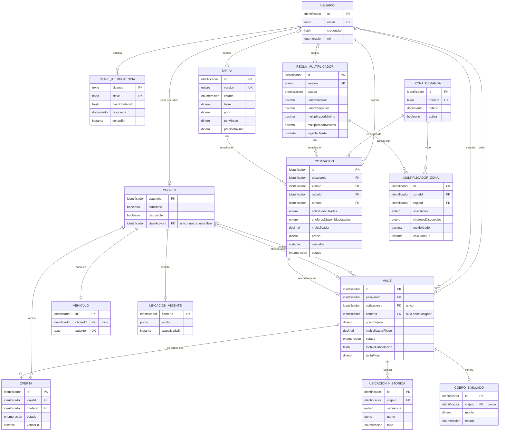
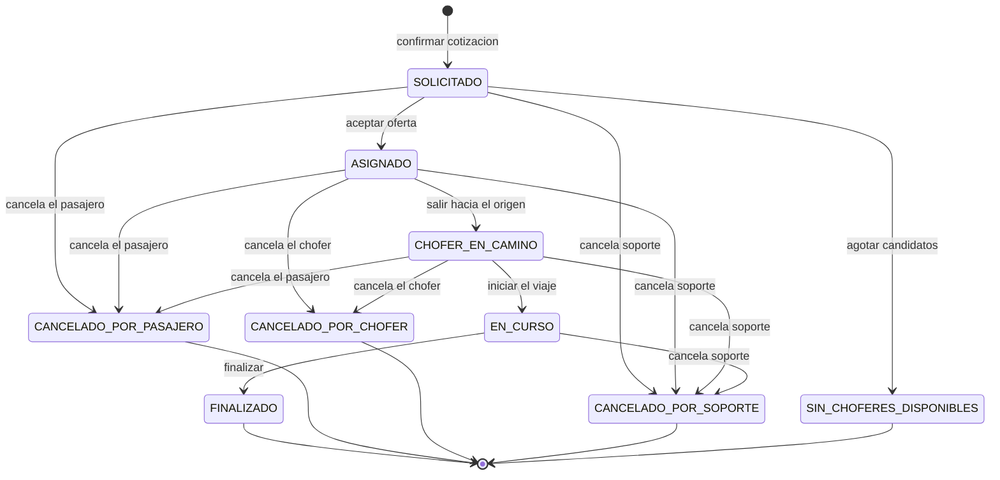
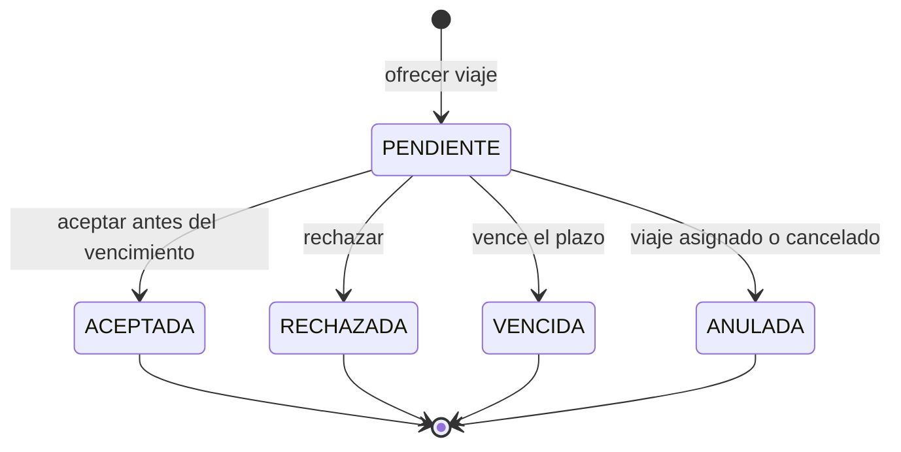
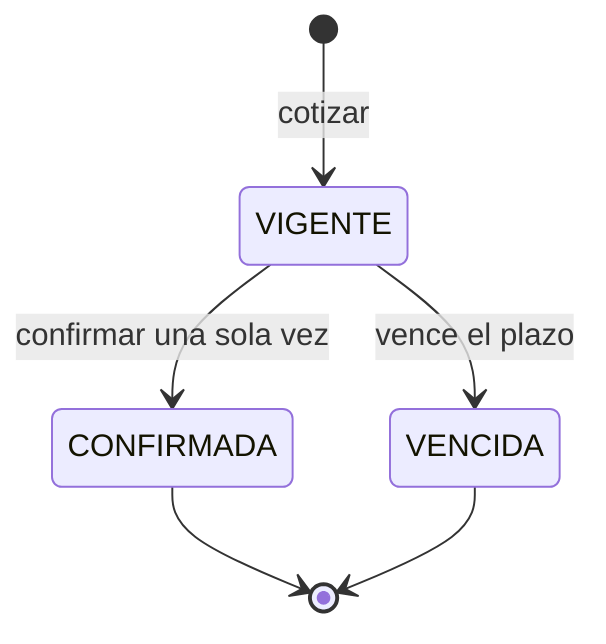
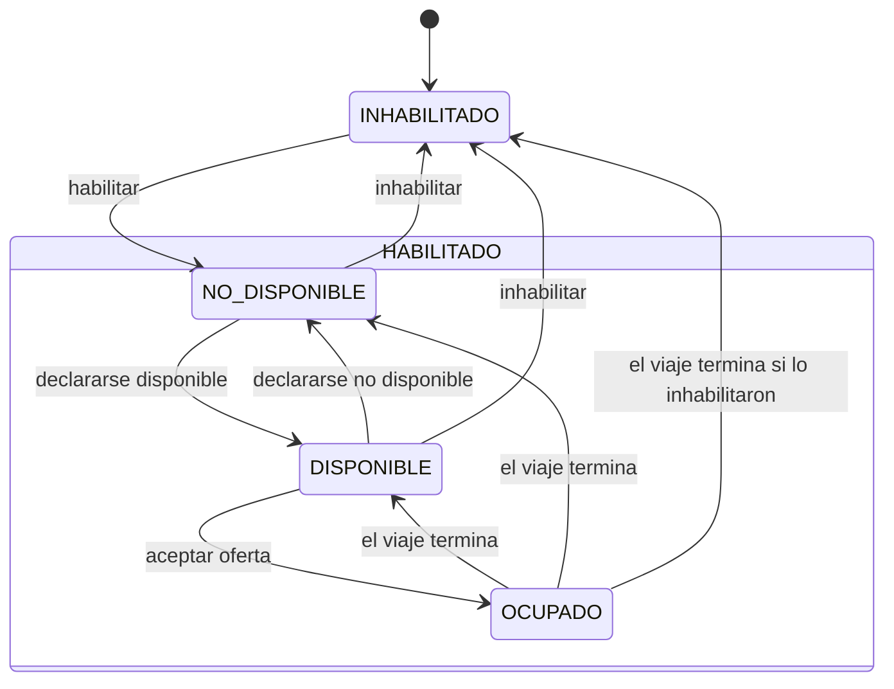
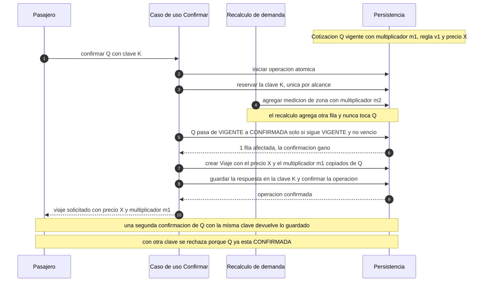

# Modelo de dominio — Plataforma de viajes con precio dinámico

> **Grupo 7 · Programación IV (UTN)** · Tarjeta «E0 · Modelo de dominio y diagrama»
>
> **Estado:** propuesta en revisión. Los tres integrantes programan sobre este modelo. Lo que se decida en la revisión se actualiza aquí antes de integrarlo.
>
> **Alcance:** variante de **precio dinámico** (un multiplicador por demanda en cada zona). No hay flotas, cupos ni administradores de flota.

**Cómo leer este documento**

- Es **independiente de la tecnología**: no asume un motor de base de datos, un ORM ni un framework web. Todo lo que aquí se llama «restricción», «índice único» o «escritura condicional» se traduce a lo que ofrezca el motor elegido en el ADR de persistencia.
- Una decisión marcada como **(propuesta)** es una recomendación de este modelo que el equipo puede cambiar en la revisión. Una pregunta que queda para otra tarjeta está en la sección 11.
- Todo valor numérico (plazos, umbrales, tarifas, multiplicadores) es un **«valor inicial a configurar»**. Este documento no fija ninguno. La lista completa está en la sección 11.2.
- Los atributos se escriben en `camelCase` sin tildes porque son los mismos nombres que aparecen en los diagramas.

**Cobertura de tarjetas**

| Tarjeta | Dónde se cubre |
|---|---|
| RF-01 Registro y autenticación | §3 Roles, §4.1 Usuario |
| RF-02 Vehículo y habilitación | §4.2 Chofer, §4.3 Vehículo, §6.4 estados del chofer |
| RF-03 Disponibilidad y ubicación | §4.2 Chofer, §4.4 UbicaciónChofer, §6.4 |
| RF-04 Estimación antes de confirmar | §4.9 Cotización, §7.2 |
| RF-05 Solicitud de viaje | §2 Confirmación, §6.3, §9.7 |
| RF-06 Búsqueda de choferes cercanos | §4.4, §6.4 (elegibilidad), §11.1 (mecanismo geográfico) |
| RF-07 Ofertas con vencimiento | §4.11 Oferta, §6.2, §9.5 |
| RF-08 Aceptación exclusiva | §9.2, §9.3 |
| RF-09 Estados del viaje | §6.1, diagrama en §10 |
| RF-10 Cancelación concurrente | §9.4 |
| RF-12 Tarifa final | §7.3 |
| RF-13 Cobro simulado | §4.12 CobroSimulado, §9.8 |
| RF-14 Historial de viajes | §3 Roles (cada usuario ve lo propio), §5 Relaciones |
| RF-15 Operador de soporte | §3 Roles, §6.1 |
| RF-16 Multiplicador por demanda | §4.6, §4.8, §7.1 |
| RF-17 Precio visible antes de confirmar | §4.9 Cotización, §9.6 |
| RF-18 Precio confirmado y auditoría | §4.10 Viaje, §8 (I4), §4.9 |
| RF-19 Carrera de recálculo y confirmación | §9.6, diagrama de secuencia en §10 |
| RF-20 Recorrido y ubicaciones históricas | §4.4, §11.1 (retención) |
| RF-21 Acceso a la ubicación del viaje | §3 Roles, §8 (I10) |
| RF-22 Viaje sin candidatos | §6.1 (`SIN_CHOFERES_DISPONIBLES`) |
| RF-23 Configuración administrativa | §3, §4.5, §4.6, §4.7 |
| Política de idempotencia | §4.13, §8 (I9), §9.7 |

RF-11 (seguimiento en tiempo real) no agrega entidades: consume las transiciones de la sección 6. Su mecanismo (WebSocket o SSE) queda en la sección 11.

---

## 1. Resumen

- Backend de una plataforma de viajes urbanos donde los pasajeros piden viajes y los choferes los aceptan, con permisos por rol (pasajero, chofer, operador de soporte y administrador).
- Cada zona de demanda tiene un **multiplicador de precio** que sube cuando las solicitudes superan a los choferes disponibles, según una **regla versionada** que configura el administrador.
- El servidor **cotiza** antes de confirmar: la cotización es una foto inmutable del precio, y el pasajero la confirma una sola vez. El viaje queda con ese precio y ese multiplicador fijados para siempre.
- El viaje se **ofrece** a choferes elegibles con ofertas que vencen; el primero que acepta lo obtiene, y las aceptaciones, cancelaciones y vencimientos simultáneos terminan siempre en estados coherentes.
- Al finalizar, el servidor calcula la tarifa final con la misma función de la estimación y registra un **cobro simulado único por viaje**; todo reintento está protegido por claves de idempotencia.

---

## 2. Glosario

| Término | Definición |
|---|---|
| **Zona de demanda** | Región geográfica en la que se mide la demanda. Todo punto pertenece a lo sumo a una zona activa. La zona de un viaje es la de su **origen**. El criterio de pertenencia (polígono, celdas, radio) lo define el ADR de búsqueda geográfica. |
| **Multiplicador** | Número decimal mayor o igual que 1 que se aplica al precio de un recorrido. Lo calcula el servidor a partir de la relación entre solicitudes y choferes disponibles de la zona, usando la regla vigente. Nunca lo envía el cliente. |
| **Regla de multiplicador** | Conjunto de parámetros (umbrales, mínimo, máximo, escala) que define cómo la demanda se convierte en multiplicador. Cada cambio publicado crea una **versión** nueva. Una versión publicada **no se modifica nunca**; la vigente es la publicada más reciente cuya fecha de vigencia ya llegó. |
| **Versión de la regla** | Número consecutivo que identifica una regla publicada. Toda cotización guarda la versión usada, para poder explicar el precio. |
| **Cotización** | Foto inmutable de una estimación: origen, destino, distancia y tiempo estimados, zona, solicitudes y choferes usados, versión de la regla, multiplicador, precio, momento de cálculo y vencimiento. Solo cambia su estado (vigente, confirmada o vencida). |
| **Confirmación** | Acto del pasajero que convierte una cotización vigente en un viaje. Se hace una sola vez por cotización, con una clave de idempotencia, y **no recibe importes**: el precio y el multiplicador salen de la cotización guardada. |
| **Oferta** | Propuesta de un viaje a un chofer elegible, con un plazo para responder. Puede aceptarse, rechazarse, vencer o anularse. |
| **Asignación** | Acto atómico por el que la aceptación de una oferta fija el chofer del viaje (`SOLICITADO` pasa a `ASIGNADO`) y marca al chofer como ocupado. |
| **Cobro simulado** | Registro del cobro de un viaje finalizado. No mueve dinero real. Hay uno solo por viaje y reintentarlo no lo duplica ni lo ejecuta dos veces. |
| **Clave de idempotencia** | Valor que envía el cliente para que repetir una operación que crea algo no la ejecute dos veces. Se guarda con su alcance, el hash del contenido y la respuesta original. La misma clave con otro contenido se rechaza. |
| **Viaje activo** | Viaje con chofer asignado que todavía no terminó: `ASIGNADO`, `CHOFER_EN_CAMINO` o `EN_CURSO`. |
| **Chofer elegible** | Chofer habilitado, disponible y libre (sin viaje activo), con ubicación vigente reciente. Es el único que puede recibir ofertas. |
| **Participantes de un viaje** | El pasajero del viaje y el chofer asignado. Son los únicos que ven las ubicaciones del viaje (RF-21). |
| **`ahora`** | Instante que entrega el puerto `Reloj` del servidor. Es la única fuente de tiempo del dominio. Nunca se usa la hora que informa el cliente. |

---

## 3. Roles

Hay cuatro roles de usuario. Además existe un actor que **no es un usuario**: el **Sistema** (procesos internos como el vencimiento de ofertas, el recálculo de demanda y la búsqueda de choferes). Cada usuario tiene un único rol.

Regla general: pasajero y chofer solo ven los registros donde **participan**. Operador de soporte y administrador ven más, según esta tabla. El detalle por endpoint va en la tarjeta «Contrato de API y permisos».

| Entidad | Pasajero | Chofer | Operador de soporte | Administrador |
|---|---|---|---|---|
| **Usuario** | Registrarse. Ver y editar el propio. | Registrarse. Ver y editar el propio. | Ver datos básicos de los participantes de los viajes que atiende. | Ver todos. Crear operadores y administradores (propuesta). |
| **Chofer** | Ver nombre, vehículo y estado del chofer asignado a su viaje. | Ver su estado. Cambiar su disponibilidad. | Ver. | Ver. Habilitar e inhabilitar (RF-02). |
| **Vehículo** | Ver el del chofer asignado a su viaje. | Registrar y editar el propio. | Ver. | Ver. |
| **UbicaciónChofer** (vigente) | Ver la de **su** chofer, solo mientras el viaje está activo (RF-21). | Enviar la propia. Ver el punto de recogida de su viaje activo (ver pregunta abierta Q13). | No. | No. |
| **UbicaciónChofer** (histórica) | Ver el recorrido de sus propios viajes. | Ver el recorrido de sus propios viajes. | Pendiente de decisión (Q14). | Pendiente de decisión (Q14). |
| **ZonaDeDemanda** | Ver la zona de su cotización. | No. | Ver. | Crear, modificar y desactivar (RF-23). |
| **ReglaDeMultiplicador** | No. Solo ve el multiplicador resultante en su cotización. | No. | Ver (para explicar un precio). | Crear borrador, publicar nueva versión, ver todas (RF-23). |
| **Tarifa** | No. Solo ve el precio resultante. | No. | Ver. | Crear borrador, publicar nueva versión, ver todas (RF-23). |
| **MultiplicadorDeZona** | Ver el vigente de la zona de su origen, al cotizar (RF-17). | No. | Ver. | Ver. |
| **Cotización** | Crear, ver y confirmar las propias. | No. | Ver (para explicar un precio). | Ver. |
| **Viaje** | Confirmar una cotización (crea el viaje). Ver y cancelar los propios, según el estado (§6.1). | Ver los viajes que se le ofrecieron o asignaron. Avanzar el viaje asignado. Cancelarlo antes de iniciarlo. | Ver los viajes en curso. Cancelar uno indicando el motivo (RF-15). | Ver todos (solo lectura). |
| **Oferta** | No. | Ver las propias. Aceptar o rechazar. | Ver. | Ver. |
| **CobroSimulado** | Ver el de sus viajes. | Ver el de sus viajes. | Ver. | Ver. |
| **ClaveDeIdempotencia** | Interna: la envía en las operaciones que crean algo, no la consulta. | Ídem. | No. | No. |

Notas:

- El **historial** de viajes (RF-14) es la vista «Viaje donde soy participante». Nadie ve viajes ajenos salvo soporte y administrador.
- El operador de soporte **no ve ubicaciones**: RF-21 dice que cualquier otra persona que consulte una ubicación es rechazada. Si soporte necesitara el recorrido histórico para resolver reclamos, se decide en Q14.

---

## 4. Entidades

### Convenciones de tipos

| Tipo conceptual | Significado |
|---|---|
| Identificador | Valor opaco y único, generado por el servidor. |
| Instante | Fecha y hora en UTC. |
| Dinero | Entero en la **unidad menor** de la moneda única del sistema (valor inicial a configurar). **Nunca** punto flotante. |
| Decimal exacto | Número decimal de escala fija, sin punto flotante. |
| Punto geográfico | Par latitud y longitud. |
| Enumeración | Conjunto cerrado de valores. |
| Hash | Resumen irreversible de un contenido. |
| Documento | Estructura serializada (por ejemplo, una respuesta guardada). |

Distancias en **metros enteros** y tiempos en **segundos enteros**. En la columna «Obligatorio», «No» significa que puede ser nulo (la descripción aclara cuándo).

### 4.1 Usuario

| Atributo | Tipo | Obligatorio | Descripción |
|---|---|---|---|
| `id` | Identificador | Sí | Identidad de la cuenta. |
| `email` | Texto | Sí | Único, sin distinguir mayúsculas. Identifica la cuenta al iniciar sesión. |
| `nombre` | Texto | Sí | Nombre para mostrar. |
| `credencial` | Hash | Sí | Hash de la contraseña (RF-01). Nunca se guarda ni se devuelve en texto plano. El algoritmo y el mecanismo de sesión los define el ADR de autenticación. |
| `rol` | Enumeración | Sí | `PASAJERO`, `CHOFER`, `OPERADOR_SOPORTE` o `ADMINISTRADOR`. Un usuario tiene un único rol: quien sea pasajero y chofer necesita dos cuentas. |
| `creadoEn` | Instante | Sí | Alta de la cuenta. |

### 4.2 Chofer

Perfil operativo de un usuario con rol `CHOFER`. Relación 1 a 1 con Usuario.

| Atributo | Tipo | Obligatorio | Descripción |
|---|---|---|---|
| `usuarioId` | Identificador | Sí | Clave primaria y referencia al Usuario. |
| `habilitado` | Booleano | Sí | Lo decide el administrador (RF-02). Nace en `false`: un chofer recién registrado no puede recibir ofertas hasta que lo habiliten. |
| `disponible` | Booleano | Sí | Lo declara el chofer (RF-03). Nace en `false`. Solo puede ser `true` si `habilitado` es `true`; al inhabilitar, pasa a `false`. |
| `viajeActivoId` | Identificador | No | Viaje activo que está atendiendo. Nulo significa **libre**; no nulo significa **ocupado**. Único: ningún viaje tiene dos choferes. |

El estado compuesto (inhabilitado, no disponible, disponible u ocupado) **se deriva** de estos tres atributos. Ver §6.4.

### 4.3 Vehículo

Relación 0..1 con Chofer (un vehículo registrado por chofer). Conjunto mínimo de datos (propuesta).

| Atributo | Tipo | Obligatorio | Descripción |
|---|---|---|---|
| `id` | Identificador | Sí | Identidad del vehículo. |
| `choferId` | Identificador | Sí | Dueño del vehículo. Único: un chofer tiene a lo sumo uno. |
| `patente` | Texto | Sí | Única en todo el sistema. |
| `marca` | Texto | Sí | Marca. |
| `modelo` | Texto | Sí | Modelo. |
| `anio` | Entero | No | Año de fabricación. |
| `color` | Texto | No | Color. |

### 4.4 UbicaciónChofer

Tiene dos formas: la **vigente** (una por chofer, se sobrescribe) y las **históricas** (una por punto reportado durante un viaje, solo se agregan).

**Vigente**

| Atributo | Tipo | Obligatorio | Descripción |
|---|---|---|---|
| `choferId` | Identificador | Sí | Clave primaria y referencia al Chofer. |
| `punto` | Punto geográfico | Sí | Última posición recibida. |
| `actualizadaEn` | Instante | Sí | Instante de **recepción en el servidor**, no el que informe el cliente. |

Un chofer solo es elegible si su ubicación vigente es reciente. La antigüedad máxima es un «valor inicial a configurar» (§11.2).

**Histórica**

| Atributo | Tipo | Obligatorio | Descripción |
|---|---|---|---|
| `id` | Identificador | Sí | Identidad del punto. |
| `viajeId` | Identificador | Sí | Viaje al que pertenece. El chofer se obtiene del viaje. |
| `secuencia` | Entero | Sí | Orden del punto dentro del viaje. Único junto con `viajeId`. |
| `punto` | Punto geográfico | Sí | Posición registrada. |
| `registradaEn` | Instante | Sí | Instante de recepción en el servidor. |
| `fase` | Enumeración | Sí | Estado del viaje al registrarla: `ACERCAMIENTO` (`ASIGNADO` o `CHOFER_EN_CAMINO`) o `EN_CURSO`. La distancia real de la tarifa final usa solo los puntos `EN_CURSO`. |

**Política de retención y agregación: pendiente de RF-20.** El modelo solo exige que se pueda reconstruir el recorrido de cada viaje y que el volumen no crezca sin control. Las opciones (conservar todo un plazo, reducir la frecuencia de puntos, conservar solo una polilínea simplificada) se resuelven en esa tarjeta.

### 4.5 ZonaDeDemanda

| Atributo | Tipo | Obligatorio | Descripción |
|---|---|---|---|
| `id` | Identificador | Sí | Identidad de la zona. |
| `nombre` | Texto | Sí | Único. |
| `criterio` | Documento | Sí | Criterio de pertenencia: geometría o regla que decide si un punto está dentro. El modelo solo exige la función `zonaDe(punto)` que devuelve una zona activa o ninguna. Lo concreta el ADR de búsqueda geográfica. |
| `activa` | Booleano | Sí | Una zona desactivada no cotiza. Las zonas **no se borran**, porque las cotizaciones y los viajes históricos la referencian. |
| `creadaEn` | Instante | Sí | Alta de la zona. |

Dos zonas activas no pueden solaparse (I16).

### 4.6 ReglaDeMultiplicador

Versionada e **inmutable una vez publicada** (I12). Una regla nace como borrador, el administrador la edita y la publica; desde ahí no cambia. Cambiar la regla es publicar una versión nueva. Hay una sola regla vigente a la vez y vale para todas las zonas.

| Atributo | Tipo | Obligatorio | Descripción |
|---|---|---|---|
| `id` | Identificador | Sí | Identidad. |
| `estado` | Enumeración | Sí | `BORRADOR` o `PUBLICADA`. El paso a `PUBLICADA` es irreversible. |
| `version` | Entero | No | Consecutivo (1, 2, 3…), único. Se asigna al publicar; en borrador es nulo. |
| `formula` | Enumeración | Sí | Familia de fórmula. Hoy solo `LINEAL_POR_TRAMOS` (ver §7.1). Permite agregar otras sin cambiar el modelo. |
| `umbralInferior` | Decimal exacto | Sí | Relación solicitudes/choferes en o por debajo de la cual se aplica el mínimo. |
| `umbralSuperior` | Decimal exacto | Sí | Relación en o por encima de la cual se aplica el máximo. Debe ser mayor que `umbralInferior`. |
| `multiplicadorMinimo` | Decimal exacto | Sí | Piso del multiplicador. Debe ser mayor o igual que 1 (propuesta: el precio dinámico solo sube, RF-16). |
| `multiplicadorMaximo` | Decimal exacto | Sí | Techo del multiplicador. Debe ser mayor o igual que el mínimo. |
| `escalaMultiplicador` | Entero | Sí | Cantidad de decimales con que se redondea el multiplicador. |
| `vigenteDesde` | Instante | No | Fecha desde la que se aplica. Obligatoria al publicar y no puede ser anterior al instante de publicación. |
| `motivo` | Texto | No | Por qué se hizo el cambio (auditoría). |
| `publicadaPorId` | Identificador | No | Administrador que la publicó. |
| `publicadaEn` | Instante | No | Instante de publicación. |
| `creadaEn` | Instante | Sí | Creación del borrador. |

**Regla vigente en `ahora`** = la `PUBLICADA` con mayor `version` entre las que tienen `vigenteDesde` menor o igual que `ahora`. Si no existe ninguna, no se puede cotizar (error de configuración incompleta).

### 4.7 Tarifa

Mismo ciclo de vida que la regla: versionada e inmutable una vez publicada (I12). Global para todas las zonas (propuesta; tarifas por zona o por tipo de vehículo quedan fuera de alcance).

| Atributo | Tipo | Obligatorio | Descripción |
|---|---|---|---|
| `id` | Identificador | Sí | Identidad. |
| `estado` | Enumeración | Sí | `BORRADOR` o `PUBLICADA`. |
| `version` | Entero | No | Consecutivo, asignado al publicar. |
| `base` | Dinero | Sí | Importe fijo de todo viaje. |
| `porKm` | Dinero | Sí | Importe por kilómetro. |
| `porMinuto` | Dinero | Sí | Importe por minuto. |
| `precioMaximo` | Dinero | Sí | **Máximo permitido**: tope del precio total, después de aplicar el multiplicador (§7.2). Debe ser mayor o igual que `base`. |
| `vigenteDesde` | Instante | No | Fecha desde la que se aplica. |
| `publicadaPorId` | Identificador | No | Administrador que la publicó. |
| `publicadaEn` | Instante | No | Instante de publicación. |
| `creadaEn` | Instante | Sí | Creación del borrador. |

### 4.8 MultiplicadorDeZona

Entidad que **no estaba en la lista mínima** y se agrega porque hace falta para auditar el recálculo (RF-16, RF-19): es la medición de demanda de una zona en un momento, y el multiplicador que resultó. Solo se agrega, nunca se modifica. La vigente de una zona es la más reciente.

| Atributo | Tipo | Obligatorio | Descripción |
|---|---|---|---|
| `id` | Identificador | Sí | Identidad. |
| `zonaId` | Identificador | Sí | Zona medida. |
| `reglaId` | Identificador | Sí | Regla (y por lo tanto versión) con que se calculó. |
| `solicitudes` | Entero | Sí | Cantidad de solicitudes contadas. Mayor o igual que 0. |
| `choferesDisponibles` | Entero | Sí | Cantidad de choferes disponibles contados. Mayor o igual que 0. |
| `parametrosDeConteo` | Documento | No | Ventana de tiempo y criterio con que se contó. Los define el ADR de precio dinámico (Q3). |
| `multiplicador` | Decimal exacto | Sí | Resultado de `calcularMultiplicador` (§7.1). |
| `calculadoEn` | Instante | Sí | Momento del cálculo. |

Si el ADR decide calcular el multiplicador **al cotizar** en lugar de periódicamente, es el caso particular de recálculo con período cero: la cotización guarda los mismos datos y esta entidad puede omitirse.

### 4.9 Cotización

Una **foto inmutable**. Todos los atributos se fijan al crearla; **solo cambia `estado`** (I11).

| Atributo | Tipo | Obligatorio | Descripción |
|---|---|---|---|
| `id` | Identificador | Sí | Identidad. |
| `pasajeroId` | Identificador | Sí | Pasajero que cotizó. Solo él puede confirmarla. |
| `origen` | Punto geográfico | Sí | Debe pertenecer a una zona activa. |
| `destino` | Punto geográfico | Sí | Debe ser distinto del origen (propuesta: distancia estimada mayor que 0). |
| `distanciaEstimadaM` | Entero | Sí | Distancia estimada en metros. La calcula el servidor. |
| `tiempoEstimadoS` | Entero | Sí | Tiempo estimado en segundos. La calcula el servidor. |
| `zonaId` | Identificador | Sí | Zona del origen. |
| `solicitudesUsadas` | Entero | Sí | Solicitudes de la zona usadas en el cálculo (RF-18). |
| `choferesDisponiblesUsados` | Entero | Sí | Choferes disponibles usados en el cálculo (RF-18). |
| `reglaId` | Identificador | Sí | Regla publicada usada. Identifica la **versión**. |
| `tarifaId` | Identificador | Sí | Tarifa publicada usada. Identifica la versión. |
| `multiplicador` | Decimal exacto | Sí | Multiplicador aplicado. |
| `precio` | Dinero | Sí | Precio estimado, ya con multiplicador, redondeo y tope. |
| `calculadaEn` | Instante | Sí | Momento del cálculo. |
| `venceEn` | Instante | Sí | Hasta cuándo se puede confirmar. Duración: «valor inicial a configurar». |
| `estado` | Enumeración | Sí | `VIGENTE`, `CONFIRMADA` o `VENCIDA`. Único atributo mutable. |

Propiedad de auditoría: con el contenido de la cotización, la función `calcularPrecio` reproduce **exactamente** `precio` (§7.2). Un test lo verifica.

El estado efectivo es el que resulta de comparar con `ahora`: una cotización `VIGENTE` con `ahora` mayor o igual que `venceEn` **ya está vencida**, aunque el proceso que persiste el estado todavía no haya corrido.

### 4.10 Viaje

| Atributo | Tipo | Obligatorio | Descripción |
|---|---|---|---|
| `id` | Identificador | Sí | Identidad. |
| `pasajeroId` | Identificador | Sí | Pasajero. |
| `cotizacionId` | Identificador | Sí | Cotización confirmada. **Única**: una cotización genera a lo sumo un viaje (I3). Por ella se llega a origen, destino, zona, regla y datos de demanda (RF-18). |
| `precioFijado` | Dinero | Sí | Precio de la cotización, copiado al confirmar. No cambia nunca (I4). |
| `multiplicadorFijado` | Decimal exacto | Sí | Multiplicador de la cotización, copiado al confirmar. No cambia nunca (I4). |
| `choferId` | Identificador | No | Chofer asignado. Se escribe **una sola vez**, en la asignación (I1). Se conserva como historial aunque el viaje se cancele. |
| `estado` | Enumeración | Sí | Ver §6.1. |
| `solicitadoEn` | Instante | Sí | Momento de la confirmación. |
| `asignadoEn` | Instante | No | Momento de la asignación. |
| `iniciadoEn` | Instante | No | Momento en que pasa a `EN_CURSO`. |
| `cerradoEn` | Instante | No | Momento en que llega a un estado terminal. |
| `canceladoPorId` | Identificador | No | Usuario que canceló (autor de la cancelación). Nulo si no fue cancelado o si cerró el sistema (`SIN_CHOFERES_DISPONIBLES`). |
| `motivoCancelacion` | Texto | No | Obligatorio y no vacío si el estado es de cancelación (RF-10, RF-15). |
| `distanciaRealM` | Entero | No | Recorrido real, al finalizar (RF-12). |
| `tiempoRealS` | Entero | No | Duración real (`cerradoEn` menos `iniciadoEn`), al finalizar. |
| `tarifaFinal` | Dinero | No | Resultado de §7.3, al finalizar. |

`precioFijado` y `multiplicadorFijado` se **copian de la cotización dentro de la misma operación atómica** de la confirmación. Nunca provienen del cliente.

### 4.11 Oferta

| Atributo | Tipo | Obligatorio | Descripción |
|---|---|---|---|
| `id` | Identificador | Sí | Identidad. |
| `viajeId` | Identificador | Sí | Viaje ofrecido. |
| `choferId` | Identificador | Sí | Chofer destinatario. Único junto con `viajeId`: a un chofer no se le ofrece dos veces el mismo viaje. |
| `orden` | Entero | Sí | Número de intento dentro del viaje. |
| `estado` | Enumeración | Sí | `PENDIENTE`, `ACEPTADA`, `RECHAZADA`, `VENCIDA` o `ANULADA`. Ver §6.2. |
| `creadaEn` | Instante | Sí | Momento en que se ofreció. |
| `venceEn` | Instante | Sí | `creadaEn` más el plazo de la oferta («valor inicial a configurar»). **Exclusivo**: se puede aceptar solo si `ahora` es menor que `venceEn`. |
| `respondidaEn` | Instante | No | Cuándo cambió de `PENDIENTE` a otro estado. |

### 4.12 CobroSimulado

| Atributo | Tipo | Obligatorio | Descripción |
|---|---|---|---|
| `id` | Identificador | Sí | Identidad. |
| `viajeId` | Identificador | Sí | Viaje cobrado. **Único** (I8). |
| `monto` | Dinero | Sí | Igual a `tarifaFinal` del viaje. |
| `estado` | Enumeración | Sí | `PENDIENTE` (registrado, la simulación aún no se ejecutó) o `COBRADO`. |
| `creadoEn` | Instante | Sí | Se crea en `PENDIENTE` dentro de la misma operación atómica que finaliza el viaje. |
| `cobradoEn` | Instante | No | Cuándo se ejecutó la simulación. |
| `referencia` | Texto | No | Identificador de la operación simulada. |

### 4.13 ClaveDeIdempotencia

| Atributo | Tipo | Obligatorio | Descripción |
|---|---|---|---|
| `clave` | Texto | Sí | Valor que envía el cliente. |
| `alcance` | Texto | Sí | Usuario y operación a los que pertenece la clave (por ejemplo, «pasajero X, confirmar cotización»). Una misma clave en alcances distintos es otra clave. La identidad es el par (`alcance`, `clave`). |
| `hashContenido` | Hash | Sí | Hash del contenido canónico de la solicitud, sin la clave. |
| `respuesta` | Documento | Sí | Resultado original guardado. Se devuelve tal cual en los reintentos. |
| `creadaEn` | Instante | Sí | Momento del primer uso. |
| `venceEn` | Instante | Sí | Hasta cuándo se recuerda la clave. «valor inicial a configurar». |

La clave se registra **en la misma operación atómica** que el efecto que protege. Así no existe un estado intermedio «en proceso» que haya que limpiar. Para efectos que ocurran fuera de esa operación (como ejecutar el cobro simulado), la tarjeta «Política de idempotencia» puede agregar uno.

---

## 5. Relaciones

«Dueña» es la entidad que controla el ciclo de vida de la otra y la que guarda la referencia.

| Relación | Cardinalidad | Entidad dueña | Notas |
|---|---|---|---|
| Usuario — Chofer | 1 a 0..1 | Usuario | Solo los usuarios con rol `CHOFER` tienen perfil. |
| Chofer — Vehículo | 1 a 0..1 | Chofer | `Vehículo.choferId` es único. |
| Chofer — UbicaciónVigente | 1 a 0..1 | Chofer | Se sobrescribe. |
| Viaje — UbicaciónHistórica | 1 a 0..N | Viaje | Solo se agregan. Al borrarse un viaje (retención), se borran sus puntos. |
| Usuario (pasajero) — Cotización | 1 a 0..N | Usuario | La cotización es del pasajero que la pidió. |
| ZonaDeDemanda — Cotización | 1 a 0..N | ZonaDeDemanda | Zona del origen. |
| ZonaDeDemanda — MultiplicadorDeZona | 1 a 0..N | ZonaDeDemanda | Historial de mediciones. |
| ReglaDeMultiplicador — MultiplicadorDeZona | 1 a 0..N | ReglaDeMultiplicador | Regla con que se calculó. |
| ReglaDeMultiplicador — Cotización | 1 a 0..N | Cotización | La cotización guarda la regla usada. |
| Tarifa — Cotización | 1 a 0..N | Cotización | La cotización guarda la tarifa usada. |
| Usuario (administrador) — Regla / Tarifa | 1 a 0..N | Usuario | Autor de la publicación (auditoría). |
| Cotización — Viaje | 1 a 0..1 | Viaje | `Viaje.cotizacionId` es único. |
| Usuario (pasajero) — Viaje | 1 a 0..N | Usuario | Base del historial del pasajero (RF-14). |
| Chofer — Viaje (asignado) | 0..1 a 0..N | Viaje | `Viaje.choferId`, nulo hasta la asignación. Base del historial del chofer. |
| Chofer — Viaje (activo) | 0..1 a 0..1 | Chofer | `Chofer.viajeActivoId`, único. Es lo que hace «ocupado» a un chofer. |
| Usuario — Viaje (cancelación) | 0..1 a 0..N | Viaje | `Viaje.canceladoPorId`. |
| Viaje — Oferta | 1 a 0..N | Viaje | Único por (`viajeId`, `choferId`). |
| Chofer — Oferta | 1 a 0..N | Oferta | Ofertas recibidas. |
| Viaje — CobroSimulado | 1 a 0..1 | Viaje | `CobroSimulado.viajeId` es único. |
| Usuario — ClaveDeIdempotencia | 1 a 0..N | Usuario | Parte del `alcance`. Sin referencia al recurso creado: el resultado vive en `respuesta`. |

---

## 6. Máquinas de estado

Regla para todas: **toda transición que no esté en la tabla se rechaza** (RF-09) y no cambia nada. Cada transición se aplica como una **escritura condicional sobre el estado de origen** (§9.1): si el estado ya no es el esperado, la transición pierde y se rechaza.

### 6.1 Viaje

| Estado origen | Evento | Actor | Estado destino | Condición y efectos |
|---|---|---|---|---|
| *(ninguno)* | Confirmar cotización | Pasajero dueño de la cotización | `SOLICITADO` | Cotización `VIGENTE` y `ahora` menor que `venceEn`. Clave de idempotencia válida. Efectos: cotización `CONFIRMADA`; `precioFijado` y `multiplicadorFijado` copiados de ella. |
| `SOLICITADO` | Aceptar oferta | Chofer destinatario | `ASIGNADO` | Oferta `PENDIENTE` y `ahora` menor que `venceEn`. Chofer habilitado, disponible y libre. Efectos: `choferId` fijado; oferta `ACEPTADA`; las demás ofertas del viaje `ANULADA`; chofer ocupado (`viajeActivoId`). |
| `SOLICITADO` | Agotar candidatos | Sistema | `SIN_CHOFERES_DISPONIBLES` | No quedan choferes elegibles sin oferta previa y ninguna oferta `PENDIENTE`, o se cumplió el plazo total de búsqueda («valor inicial a configurar»). Efecto: ofertas `PENDIENTE` pasan a `ANULADA`. |
| `SOLICITADO` | Cancelar | Pasajero dueño | `CANCELADO_POR_PASAJERO` | Motivo informado. Efecto: ofertas `PENDIENTE` pasan a `ANULADA`. |
| `SOLICITADO` | Cancelar | Operador de soporte | `CANCELADO_POR_SOPORTE` *(propuesta)* | Motivo informado. Mismo efecto sobre las ofertas. |
| `ASIGNADO` | Salir hacia el origen | Chofer asignado | `CHOFER_EN_CAMINO` | — |
| `ASIGNADO`, `CHOFER_EN_CAMINO` | Cancelar | Pasajero dueño | `CANCELADO_POR_PASAJERO` | Motivo informado. Efecto: chofer liberado. |
| `ASIGNADO`, `CHOFER_EN_CAMINO` | Cancelar | Chofer asignado | `CANCELADO_POR_CHOFER` | Motivo informado. Efecto: chofer liberado. El pasajero deberá cotizar de nuevo. |
| `ASIGNADO`, `CHOFER_EN_CAMINO` | Cancelar | Operador de soporte | `CANCELADO_POR_SOPORTE` *(propuesta)* | Motivo informado. Efecto: chofer liberado. |
| `CHOFER_EN_CAMINO` | Iniciar el viaje | Chofer asignado | `EN_CURSO` | Fija `iniciadoEn`. |
| `EN_CURSO` | Finalizar | Chofer asignado | `FINALIZADO` | Calcula `distanciaRealM`, `tiempoRealS` y `tarifaFinal` (§7.3). Efectos: chofer liberado; `CobroSimulado` creado en `PENDIENTE`. |
| `EN_CURSO` | Cancelar | Operador de soporte | `CANCELADO_POR_SOPORTE` *(propuesta)* | Motivo informado. Efecto: chofer liberado. No se genera cobro. |

**Estados terminales** (desde ellos no sale ninguna transición): `FINALIZADO`, `CANCELADO_POR_PASAJERO`, `CANCELADO_POR_CHOFER`, `CANCELADO_POR_SOPORTE` y `SIN_CHOFERES_DISPONIBLES`.

| Estado | ¿Terminal? | ¿Tiene chofer asignado? | ¿Chofer ocupado? |
|---|---|---|---|
| `SOLICITADO` | No | No | — |
| `ASIGNADO` | No | Sí | Sí |
| `CHOFER_EN_CAMINO` | No | Sí | Sí |
| `EN_CURSO` | No | Sí | Sí |
| `FINALIZADO` | Sí | Sí | No |
| `CANCELADO_POR_PASAJERO` | Sí | Solo si cancelaron después de asignar | No |
| `CANCELADO_POR_CHOFER` | Sí | Sí | No |
| `CANCELADO_POR_SOPORTE` | Sí | Solo si cancelaron después de asignar | No |
| `SIN_CHOFERES_DISPONIBLES` | Sí | No | — |

Decisiones de este modelo, a confirmar en la revisión:

- **`CANCELADO_POR_SOPORTE` (propuesta).** RF-09 lista ocho estados, pero RF-15 permite que el operador cancele un viaje, y ninguno de los ocho dice «cancelado por soporte». Se agrega un estado terminal en lugar de forzar el cancelado a «por pasajero» o «por chofer», que falsearía el autor. Si el equipo prefiere no agregarlo, hay que decidir con qué estado cierra la cancelación de soporte (Q10).
- El pasajero **no puede cancelar** un viaje `EN_CURSO` (propuesta). Solo soporte puede.
- Un viaje cancelado por el chofer o sin choferes **no se reabre**: el pasajero cotiza y confirma de nuevo.
- Los viajes cancelados o sin choferes **no generan cobro**. Un cargo por cancelación queda fuera de alcance.

### 6.2 Oferta

| Estado origen | Evento | Actor | Estado destino | Condición y efectos |
|---|---|---|---|---|
| *(ninguno)* | Ofrecer el viaje | Sistema | `PENDIENTE` | Viaje `SOLICITADO`. Chofer elegible. No existe oferta previa para ese par viaje y chofer. `venceEn` igual a `creadaEn` más el plazo. |
| `PENDIENTE` | Aceptar | Chofer destinatario | `ACEPTADA` | `ahora` menor que `venceEn`. Viaje `SOLICITADO`. Chofer elegible (se revalida). Dispara la asignación del viaje (§6.1). |
| `PENDIENTE` | Rechazar | Chofer destinatario | `RECHAZADA` | `ahora` menor que `venceEn`. Efecto: la búsqueda sigue con el siguiente candidato. |
| `PENDIENTE` | Vencer | Sistema | `VENCIDA` | `ahora` mayor o igual que `venceEn`. Efecto: la búsqueda sigue con el siguiente candidato o el viaje pasa a `SIN_CHOFERES_DISPONIBLES`. |
| `PENDIENTE` | Anular | Sistema | `ANULADA` | El viaje se asignó a otro chofer, se canceló o pasó a `SIN_CHOFERES_DISPONIBLES`. |

**Terminales:** `ACEPTADA`, `RECHAZADA`, `VENCIDA` y `ANULADA`. Una oferta `ACEPTADA` queda así aunque el viaje se cancele después: registra un hecho.

Cuántas ofertas `PENDIENTE` puede tener un viaje a la vez (una por vez o varias en paralelo) es configurable y lo decide el ADR de asignación (Q5). **Todas las garantías de este documento valen en ambos casos.**

### 6.3 Cotización

| Estado origen | Evento | Actor | Estado destino | Condición y efectos |
|---|---|---|---|---|
| *(ninguno)* | Cotizar | Pasajero | `VIGENTE` | Origen dentro de una zona activa. Regla y tarifa vigentes. `venceEn` igual a `calculadaEn` más la vigencia («valor inicial a configurar»). |
| `VIGENTE` | Confirmar | Pasajero dueño | `CONFIRMADA` | `ahora` menor que `venceEn`. Se confirma **una sola vez**. Genera exactamente un viaje, en la misma operación atómica. |
| `VIGENTE` | Vencer | Sistema, o al consultarla o confirmarla | `VENCIDA` | `ahora` mayor o igual que `venceEn`. |

**Terminales:** `CONFIRMADA` y `VENCIDA`. Una cotización vencida **no se reactiva**: se pide otra, que puede tener otro precio.

Un recálculo del multiplicador o la publicación de una regla o tarifa nueva **no cambian ni invalidan** una cotización vigente. Es una decisión del modelo: el precio que el pasajero vio es el que paga (RF-17, RF-18, RF-19).

### 6.4 Chofer

Un chofer tiene dos estados independientes: **habilitado** (lo decide el administrador) y **ocupado** (lo determina `viajeActivoId`). Dentro de habilitado, `disponible` es lo que el chofer declara. Los cuatro estados resultantes:

| Estado | Condición sobre los atributos |
|---|---|
| `INHABILITADO` | `habilitado` es `false` y `viajeActivoId` es nulo. |
| `NO_DISPONIBLE` | `habilitado` es `true`, `disponible` es `false` y `viajeActivoId` es nulo. |
| `DISPONIBLE` | `habilitado` es `true`, `disponible` es `true` y `viajeActivoId` es nulo. |
| `OCUPADO` | `viajeActivoId` no es nulo. |

| Estado origen | Evento | Actor | Estado destino | Condición y efectos |
|---|---|---|---|---|
| `INHABILITADO` | Habilitar | Administrador | `NO_DISPONIBLE` | Tiene un vehículo registrado (propuesta, Q11). |
| `NO_DISPONIBLE` | Declararse disponible | Chofer | `DISPONIBLE` | Está habilitado. |
| `DISPONIBLE` | Declararse no disponible | Chofer | `NO_DISPONIBLE` | — |
| `DISPONIBLE` | Aceptar oferta (asignación) | Chofer | `OCUPADO` | Sigue habilitado, disponible y libre al momento de aceptar. Se hace de forma atómica con la asignación del viaje (§9.2). |
| `OCUPADO` | Declararse disponible o no disponible | Chofer | `OCUPADO` | Se registra `disponible`. No interrumpe el viaje. Solo si está habilitado. |
| `OCUPADO` | El viaje activo termina | Sistema | `DISPONIBLE` | El viaje llegó a un estado terminal, el chofer sigue habilitado y `disponible` es `true`. Efecto: `viajeActivoId` pasa a nulo. |
| `OCUPADO` | El viaje activo termina | Sistema | `NO_DISPONIBLE` | Ídem, sigue habilitado y `disponible` es `false`. |
| `OCUPADO` | El viaje activo termina | Sistema | `INHABILITADO` | Ídem, pero lo inhabilitaron mientras tanto. |
| `NO_DISPONIBLE`, `DISPONIBLE` | Inhabilitar | Administrador | `INHABILITADO` | `disponible` pasa a `false`. Las ofertas pendientes que tenga no se pueden aceptar (se revalida al aceptar). |
| `OCUPADO` | Inhabilitar | Administrador | `OCUPADO` | **Propuesta:** se permite. `habilitado` y `disponible` pasan a `false`; el viaje activo **no se interrumpe**. Al terminar pasa a `INHABILITADO` (Q12). |

Solo un chofer **elegible** recibe ofertas (I5): `DISPONIBLE` y con ubicación vigente reciente.

---

## 7. Regla de precio

Todo el cálculo ocurre en el servidor. **Ningún importe, multiplicador, distancia ni tiempo enviado por el cliente se usa para fijar un precio.** El dominio implementa estas funciones como lógica pura: reciben datos y devuelven un resultado, sin acceder a la base ni al reloj.

La aritmética es **exacta** (enteros y decimales de escala fija, nunca punto flotante) y hay un **único redondeo**, al final, para que cotización y tarifa final coincidan al centavo.

### 7.1 Multiplicador

```text
funcion calcularMultiplicador(regla, solicitudes, choferesDisponibles) -> Decimal
    // Relación de demanda. Contempla la división por cero.
    si choferesDisponibles == 0:
        relacion = (solicitudes > 0) ? INFINITO : 0
    sino:
        relacion = solicitudes / choferesDisponibles          // exacta

    // Fórmula LINEAL_POR_TRAMOS
    si relacion <= regla.umbralInferior:
        m = regla.multiplicadorMinimo
    sino si relacion >= regla.umbralSuperior:
        m = regla.multiplicadorMaximo
    sino:
        fraccion = (relacion - regla.umbralInferior)
                 / (regla.umbralSuperior - regla.umbralInferior)
        m = regla.multiplicadorMinimo
          + fraccion * (regla.multiplicadorMaximo - regla.multiplicadorMinimo)

    m = redondear(m, regla.escalaMultiplicador, MITAD_HACIA_ARRIBA)
    retornar acotar(m, regla.multiplicadorMinimo, regla.multiplicadorMaximo)
```

Propiedades que se prueban con tests de la función pura (RF-16): el resultado siempre está entre mínimo y máximo; **no decrece** cuando suben las solicitudes y no sube cuando suben los choferes; con demanda baja da el mínimo, con demanda alta da el máximo y en los límites exactos de los umbrales da el mínimo y el máximo respectivamente; con 0 choferes y 0 solicitudes da el mínimo, y con 0 choferes y más de 0 solicitudes da el máximo.

Qué se cuenta como «solicitud» y como «chofer disponible», y en qué ventana de tiempo, **no lo fija este modelo** (Q3). Por eso la cotización guarda los dos números usados: el cálculo se puede reproducir sin saber cómo se contó.

### 7.2 Precio estimado

```text
funcion calcularPrecio(tarifa, distanciaM, tiempoS, multiplicador) -> Dinero
    // Precondiciones: distanciaM >= 0, tiempoS >= 0, multiplicador >= 1
    subtotal = tarifa.base
             + tarifa.porKm     * distanciaM / 1000            // exacto
             + tarifa.porMinuto * tiempoS    / 60              // exacto
    bruto      = subtotal * multiplicador                      // exacto
    redondeado = redondearAUnidadMenor(bruto, MITAD_HACIA_ARRIBA)   // único redondeo
    retornar minimo(redondeado, tarifa.precioMaximo)           // tope
```

```text
funcion cotizar(pasajero, origen, destino, ahora) -> Cotizacion
    zona = zonaDe(origen)
    si zona no existe o no esta activa: rechazar FUERA_DE_COBERTURA
    (distanciaM, tiempoS) = estimarRecorrido(origen, destino)  // puerto, lo calcula el servidor
    regla  = reglaVigente(ahora)
    tarifa = tarifaVigente(ahora)
    medicion = demandaVigente(zona, ahora)                     // solicitudes y choferes
    m      = calcularMultiplicador(regla, medicion.solicitudes, medicion.choferesDisponibles)
    precio = calcularPrecio(tarifa, distanciaM, tiempoS, m)
    retornar Cotizacion { ..., multiplicador: m, precio: precio,
                          calculadaEn: ahora, venceEn: ahora + vigenciaCotizacion,
                          estado: VIGENTE }
```

El tope se aplica **al total, después del multiplicador**: `precioMaximo` es de verdad el máximo que un pasajero puede pagar por un viaje. La contracara es que en recorridos muy largos el multiplicador deja de tener efecto cuando se alcanza el tope. Aplicar el tope antes del multiplicador permitiría superar el «máximo permitido»; por eso no se propone.

### 7.3 Tarifa final

Se calcula con la **misma función** `calcularPrecio`, pero con el recorrido real, la tarifa **de la cotización** (no la vigente hoy) y el multiplicador **fijado al confirmar** (no el actual).

```text
funcion tarifaFinal(viaje, cotizacion, distanciaRealM, tiempoRealS) -> Dinero
    tarifa     = cotizacion.tarifa                 // la usada al cotizar
    calculado  = calcularPrecio(tarifa, distanciaRealM, tiempoRealS, viaje.multiplicadorFijado)
    retornar minimo(calculado, viaje.precioFijado) // el pasajero nunca paga más de lo que vio
```

> **Decisión de producto a confirmar en RF-12 (propuesta A).** RF-12 pide usar «el precio y el multiplicador fijados al confirmar», y RF-18 y RF-19 piden que el precio visto sea el que se paga. Hay tres lecturas posibles:
>
> | Opción | Cobro | Ventaja | Costo |
> |---|---|---|---|
> | **A (propuesta)** | El menor entre el calculado con el recorrido real y el `precioFijado`. | Nunca se cobra más de lo mostrado; un recorrido más corto cuesta menos. | Un desvío largo no se cobra de más. |
> | B | Siempre `precioFijado`. | Es lo más literal de «el precio que vio es el que paga». | El recorrido real no influye; RF-12 pierde sentido. |
> | C | Siempre el calculado con el recorrido real, sin límite superior. | Refleja el recorrido real. | Puede superar lo que el pasajero vio. |
>
> En las tres, la demanda posterior **no** altera el cobro.

### 7.4 Casos límite

| Caso | Resultado |
|---|---|
| Distancia 0 y tiempo 0 | `subtotal` es `base`; el precio es `minimo(redondeo(base × m), precioMaximo)`. No es un error: la función está definida. |
| Distancia 0 y tiempo mayor que 0 | `base` más el componente por minuto, con multiplicador y tope. |
| Subtotal con multiplicador por encima de `precioMaximo` | El precio es `precioMaximo`. El multiplicador registrado **no** se altera: queda el que se calculó. |
| Recorrido real por encima del máximo | `calcularPrecio` ya aplica el tope, y la tarifa final nunca supera `precioFijado`. |
| 0 choferes disponibles | Ver §7.1: máximo si hay solicitudes, mínimo si no. |
| Relación exactamente en un umbral | Umbral inferior da el mínimo; umbral superior da el máximo (comparaciones cerradas). |
| La demanda cambia después de confirmar | No afecta: se usa `multiplicadorFijado`. |
| Se publica una tarifa o regla nueva después de confirmar | No afecta: se usa la tarifa de la cotización. |
| Faltan puntos para reconstruir el recorrido real | Sin resolver: Q9 (propuesta: usar la distancia estimada). |

---

## 8. Invariantes

«Dónde» indica si la invariante se garantiza en el **dominio** (la lógica rechaza o impide la operación), en la **base de datos** (restricción o índice único; a confirmar en el ADR de persistencia) o en **ambos**. Una invariante garantizada solo en el dominio se debe poder comprobar igual con el verificador de consistencia (§9.9).

| # | Invariante | Dónde | Cómo se garantiza |
|---|---|---|---|
| I1 | Un viaje tiene como máximo un chofer asignado. | Ambos | Dominio: `choferId` se escribe una sola vez, y solo en `SOLICITADO` a `ASIGNADO`. Base: es un único atributo, y la escritura es condicional (`choferId` nulo y estado `SOLICITADO`). |
| I2 | Un chofer tiene como máximo un viaje activo. | Ambos | Dominio: solo se asigna a un chofer libre. Base: `Chofer.viajeActivoId` es un solo atributo, único, y se escribe de forma condicional (hoy nulo). Alternativa a evaluar en el ADR: índice único parcial sobre los viajes activos por chofer. |
| I3 | Una cotización se confirma una sola vez y genera como máximo un viaje. | Ambos | Dominio: transición `VIGENTE` a `CONFIRMADA` única. Base: `Viaje.cotizacionId` único. |
| I4 | El precio y el multiplicador de un viaje confirmado no cambian nunca. | Ambos | Dominio: no existe ninguna operación que los modifique; se copian de la cotización dentro de la confirmación. Base: refuerzo opcional según el motor (por ejemplo, impedir la actualización de esas columnas). Se verifica además que coincidan con la cotización. |
| I5 | Solo un chofer habilitado y disponible puede recibir ofertas. | Dominio | La búsqueda ofrece solo a choferes elegibles, y al aceptar se **revalida** como condición de la escritura. No hay restricción declarativa simple: depende de varias tablas. |
| I6 | Una oferta vencida no se puede aceptar. | Ambos | Dominio: se compara `ahora` con `venceEn` aunque el proceso de vencimiento no haya corrido. Base: la aceptación es una escritura condicional (`estado` igual a `PENDIENTE`). |
| I7 | Un viaje cancelado no tiene un chofer ocupado: ningún `viajeActivoId` apunta a un viaje terminal. | Dominio | La cancelación y la liberación del chofer ocurren en **la misma operación atómica**. No hay restricción declarativa simple; lo comprueba el verificador (§9.9). |
| I8 | El cobro simulado es único por viaje. | Ambos | Base: `CobroSimulado.viajeId` único. Dominio: solo se crea al finalizar el viaje. |
| I9 | La misma clave de idempotencia con otro contenido se rechaza. | Ambos | Base: par (`alcance`, `clave`) único. Dominio: se compara `hashContenido` antes de devolver lo guardado. |
| I10 | Solo los participantes del viaje ven las ubicaciones (RF-21). | Dominio | Autorización en el caso de uso de consulta: solo el pasajero del viaje y el chofer asignado, y solo mientras el viaje está activo. No es una restricción de datos. |
| I11 | Una cotización es inmutable salvo su `estado`. | Ambos | Dominio: no hay operación que la modifique. Base: refuerzo opcional según el motor. |
| I12 | Una regla o tarifa publicada es inmutable; cambiarla es publicar una versión nueva. | Ambos | Dominio: la edición solo existe en `BORRADOR`. Base: `version` única. |
| I13 | El estado de un viaje solo cambia por las transiciones de la tabla 6.1, y desde un estado terminal no cambia. | Ambos | Dominio: función de transición. Base: la escritura es condicional sobre el estado de origen, y el campo solo admite los valores del conjunto. |
| I14 | A un chofer se le ofrece una sola vez el mismo viaje. | Base | Par (`viajeId`, `choferId`) único en Oferta. |
| I15 | Un viaje tiene como máximo una oferta `ACEPTADA`. | Ambos | Dominio: la aceptación pasa por la asignación. Base: índice único parcial sobre ofertas aceptadas por viaje (si el motor lo permite). |
| I16 | Un punto pertenece a lo sumo a una zona activa. | Dominio | Se valida al crear o modificar una zona. Los detalles dependen del mecanismo geográfico (ADR de búsqueda geográfica). |
| I17 | El estado del viaje y su chofer son coherentes: `ASIGNADO`, `CHOFER_EN_CAMINO`, `EN_CURSO` y `FINALIZADO` tienen chofer; `SOLICITADO` y `SIN_CHOFERES_DISPONIBLES` no. Un viaje cancelado con chofer conserva `choferId` como historial. | Ambos | Dominio: transiciones. Base: restricción de verificación (si el motor la ofrece). |
| I18 | El multiplicador de una cotización está entre el mínimo y el máximo de su regla, y el precio no supera el `precioMaximo` de su tarifa. | Ambos | Dominio: `calcularMultiplicador` y `calcularPrecio`. Base: restricción de verificación. |
| I19 | Ningún importe lo decide el cliente. | Dominio | Los casos de uso de confirmar, finalizar y cobrar **no tienen parámetros de importe**. |

---

## 9. Carreras

### 9.1 Convenciones comunes

**Forma de implementación.** El dominio decide **qué** transición corresponde (funciones puras que reciben el estado actual y devuelven el nuevo estado y los efectos, o un rechazo). La **atomicidad** la aporta un puerto de persistencia con operaciones condicionales. Así el dominio no conoce la base ni Express.

**Puertos que asume el modelo** (sin elegir tecnología):

| Puerto | Para qué |
|---|---|
| `Reloj` | Entrega `ahora`. Se toma **una vez por operación**. Los tests lo controlan. |
| `UnidadDeTrabajo` | Ejecuta varias escrituras como una sola operación atómica o no ejecuta ninguna. |
| Repositorios con **escritura condicional** | Por ejemplo, `transicionar(id, desde, hacia, cambios)` devuelve si la operación ganó. |
| `EstimadorDeRecorrido` | Distancia y tiempo estimados entre dos puntos. |
| `Zonas` y `BuscadorDeChoferesCercanos` | Pertenencia a zona y búsqueda geográfica. |
| `SimuladorDeCobro` | Ejecuta el cobro simulado. |
| `Notificador` | Entrega cambios de estado en tiempo real (RF-11). |

**Escritura condicional (compare-and-set).** Notación usada en este documento:

```text
ACTUALIZAR <recurso> CAMBIAR <campos> DONDE id = :id Y estado = <esperado> [Y otras condiciones]
// Si afecta 0 filas, la operación perdió la carrera y se rechaza. Si afecta 1, ganó.
```

Dos operaciones concurrentes sobre la misma fila **se serializan**: la segunda evalúa su condición sobre el resultado de la primera. Eso es lo que se exige del motor, sin importar cuál sea.

**Operación atómica.** Cada operación del dominio que toca varias entidades (confirmar, aceptar, cancelar, finalizar) se ejecuta como **una sola operación atómica**: o se aplican todos sus cambios o ninguno. El nivel de aislamiento necesario lo fija el ADR de persistencia; el requisito es que **cada condición se evalúe sobre el último valor confirmado**.

**Principio general: un viaje es el punto de serialización.** Cualquier par de transiciones concurrentes sobre un mismo viaje (aceptar, cancelar, avanzar, finalizar, agotar candidatos) se serializa por la fila del viaje. La segunda se evalúa contra el estado que dejó la primera y, si ya no corresponde, se rechaza con `TRANSICION_INVALIDA`. Por eso este documento no repite cada combinación.

**Reloj.** `ahora` se toma del puerto `Reloj`, nunca del cliente. Si hay más de una instancia del servidor, el reloj debe ser común (por ejemplo, el de la base); lo decide el ADR de asignación (Q15). Los vencimientos son **exclusivos**: se acepta solo si `ahora` es menor que `venceEn`.

**Motivos de rechazo del dominio** (nombres lógicos, no códigos HTTP; el mapeo va en «Contrato de API y permisos» y «Errores y trazabilidad»):

| Motivo | Cuándo |
|---|---|
| `TRANSICION_INVALIDA` | El estado actual no admite el evento, o el actor no puede ejecutarlo. |
| `VIAJE_NO_DISPONIBLE` | Se intentó aceptar un viaje que ya no está `SOLICITADO`. |
| `OFERTA_VENCIDA` | La oferta venció (por estado o por `ahora` mayor o igual que `venceEn`). |
| `OFERTA_NO_PENDIENTE` | La oferta ya fue respondida o anulada. |
| `CHOFER_NO_ELEGIBLE` | El chofer no está habilitado o disponible al aceptar. |
| `CHOFER_OCUPADO` | El chofer ya tiene un viaje activo. |
| `COTIZACION_VENCIDA` | `ahora` mayor o igual que `venceEn`. |
| `COTIZACION_YA_CONFIRMADA` | La cotización ya generó un viaje. |
| `CLAVE_REUTILIZADA_CON_OTRO_CONTENIDO` | Misma clave y alcance con distinto `hashContenido`. |

Los perdedores de una carrera reciben siempre uno de estos rechazos **claros**. Un error técnico (por ejemplo, un bloqueo mutuo o un tiempo de espera agotado) **no debe llegar al cliente**: se reintenta internamente.

**Orden de bloqueo global (propuesta; lo cierra el «ADR de asignación y cancelación»).** Para evitar interbloqueos, toda operación que necesite varios recursos los toma **siempre en este orden**, y nunca pide uno de rango menor teniendo uno de rango mayor:

| Rango | Recurso | Operaciones que lo toman |
|---|---|---|
| 1 | `ClaveDeIdempotencia` | Toda operación que exige clave. |
| 2 | `Cotización` | Confirmar. |
| 3 | `Viaje` | Aceptar, cancelar, avanzar, finalizar, vencer y agotar candidatos. |
| 4 | `Oferta` (varias, por `id` ascendente) | Aceptar, cancelar, vencer. |
| 5 | `Chofer` | Aceptar (ocupar), cancelar y finalizar (liberar). |
| 6 | `CobroSimulado` | Finalizar. |

Reglas adicionales:

- Para saber de qué viaje es una oferta se puede leer la oferta **sin bloquearla** (su `viajeId` no cambia nunca) y luego bloquear en orden.
- Una operación que toca **un solo recurso** (vencer una oferta, actualizar la ubicación, registrar una medición de zona, publicar una regla, habilitar a un chofer) no puede formar un ciclo.
- Las **consecuencias** de una operación que exigirían volver a un rango menor se hacen en una operación posterior y separada. Ejemplo: al vencer una oferta, esa operación solo cambia la oferta; la decisión de pasar al siguiente candidato o a `SIN_CHOFERES_DISPONIBLES` se toma en otra operación que bloquea primero el viaje (rango 3) y luego las ofertas (rango 4).
- Como defensa adicional, si el motor detecta un interbloqueo, la operación se reintenta un número limitado de veces. Es una red de seguridad, no el mecanismo principal.

**Sobre los tests de esta sección.** Son tests de **integración contra la base real**, no contra dobles: lo que se prueba es la atomicidad que aporta el motor. Las operaciones simultáneas se liberan juntas con una barrera. Para forzar un orden concreto sin pausas arbitrarias se usa un decorador de prueba del puerto de persistencia que detiene una operación en un punto dado. Cada test se repite varias veces (cantidad: «valor inicial a configurar») y termina con el verificador de consistencia (§9.9).

### 9.2 Cincuenta o más aceptaciones simultáneas del mismo viaje (RF-08)

**Escenario.** El viaje V está `SOLICITADO` y hay 50 o más choferes elegibles, cada uno con una oferta `PENDIENTE` de V. Todos aceptan al mismo tiempo. (El buscador real puede enviar una oferta por vez; el test las crea directamente. La garantía no depende de cuántas ofertas envíe el sistema en producción.) Variante: un mismo chofer envía la misma aceptación 50 veces.

**Resultados válidos.**

- Exactamente **una** aceptación termina con éxito. Esa oferta queda `ACEPTADA`, V queda `ASIGNADO` con ese `choferId`, y ese chofer queda ocupado con V.
- Las demás reciben `VIAJE_NO_DISPONIBLE` (o `OFERTA_NO_PENDIENTE`, si su oferta ya fue anulada). Sus ofertas quedan `ANULADA` y sus choferes siguen libres y disponibles.
- En la variante de un mismo chofer, las repeticiones posteriores reciben el mismo resultado o `OFERTA_NO_PENDIENTE`; nunca una segunda asignación.

**Resultados que nunca pueden ocurrir.**

- Dos o más aceptaciones con éxito.
- V con más de un chofer, o con el `choferId` sobrescrito por otro.
- Más de un chofer con `viajeActivoId` igual a V.
- El ganador sin quedar ocupado, o un perdedor ocupado.
- Ofertas de V que sigan `PENDIENTE` después de la asignación.
- Un error técnico (bloqueo mutuo, tiempo de espera) como respuesta a un perdedor.

**Recurso que se bloquea o condición atómica (propuesta).** Se serializa por la **fila del Viaje**. Toda la aceptación es una sola operación atómica que, en el orden del §9.1, hace:

```text
1. ACTUALIZAR Viaje  CAMBIAR estado = ASIGNADO, choferId = :c, asignadoEn = :ahora
                     DONDE id = :v Y estado = SOLICITADO Y choferId es nulo
   // 0 filas: perdió. Rechazar VIAJE_NO_DISPONIBLE.
2. ACTUALIZAR Oferta CAMBIAR estado = ACEPTADA
                     DONDE id = :o Y estado = PENDIENTE Y venceEn > :ahora
   // 0 filas: deshacer todo. Rechazar OFERTA_VENCIDA u OFERTA_NO_PENDIENTE.
3. ACTUALIZAR Ofertas del viaje CAMBIAR estado = ANULADA
                     DONDE viajeId = :v Y estado = PENDIENTE Y id <> :o
4. ACTUALIZAR Chofer CAMBIAR viajeActivoId = :v
                     DONDE usuarioId = :c Y habilitado Y disponible Y viajeActivoId es nulo
   // 0 filas: deshacer todo. Rechazar CHOFER_NO_ELEGIBLE o CHOFER_OCUPADO.
```

Si algún paso falla, **se deshace toda la operación**, incluido el paso 1. Los índices únicos de I1, I2 y I15 son la segunda línea de defensa.

**Test.** `aceptaciones-simultaneas-mismo-viaje` (RF-08). Prepara V y 50 choferes con oferta pendiente, libera las 50 aceptaciones a la vez y verifica: exactamente 1 éxito y 49 rechazos con motivo claro, sin errores técnicos; estado de V, de las ofertas y de los 50 choferes; y el verificador de consistencia. Repite la variante del mismo chofer.

### 9.3 Un chofer que acepta dos viajes a la vez (RF-08)

**Escenario.** El chofer C tiene una oferta `PENDIENTE` del viaje A y otra del viaje B. Acepta ambas simultáneamente (por ejemplo, desde dos dispositivos).

**Resultados válidos.** Exactamente uno de los dos viajes queda `ASIGNADO` a C, y C queda ocupado con él. La otra aceptación recibe `CHOFER_OCUPADO`. El viaje que no se asignó **sigue `SOLICITADO`**, con su oferta a C todavía `PENDIENTE` hasta que venza, y la búsqueda continúa con otros candidatos. Cuál de los dos gana depende del orden de llegada; ambos son válidos.

**Resultados que nunca pueden ocurrir.**

- A y B `ASIGNADO` a C.
- C con `viajeActivoId` apuntando a un viaje y otro viaje `ASIGNADO` a C.
- Un viaje `ASIGNADO` a C cuando C quedó ocupado con el otro.
- Un viaje que quede en un estado intermedio (por ejemplo, `ASIGNADO` sin que C esté ocupado) por haber perdido la segunda parte de la operación.

**Recurso que se bloquea o condición atómica (propuesta).** Cada aceptación bloquea **su** viaje (rango 3) y después **al chofer** (rango 5). Las dos pelean por la fila del Chofer; la condición `viajeActivoId es nulo` del paso 4 (§9.2) deja pasar a una sola. La que pierde **deshace su operación completa**, de modo que su viaje queda intacto. No hay interbloqueo: ambas toman los recursos en el mismo orden.

Una optimización posible (no necesaria para la corrección): al ocupar a C, una operación posterior anula las otras ofertas pendientes de C para que sus viajes sigan sin esperar el vencimiento. Y la búsqueda puede evitar ofrecer un viaje a un chofer que ya tiene una oferta pendiente, lo que reduce las colisiones pero no reemplaza la garantía atómica.

**Test.** `chofer-acepta-dos-viajes-a-la-vez` (RF-08). Verifica que exactamente uno de A y B está `ASIGNADO` a C; que el otro sigue `SOLICITADO`; que C está ocupado con el que ganó; que la otra aceptación recibió `CHOFER_OCUPADO`; y el verificador.

### 9.4 Aceptación contra cancelación (RF-10)

**Escenario.** Un viaje `SOLICITADO` recibe, al mismo tiempo, la aceptación de una oferta por el chofer C y la cancelación por el pasajero. (Es lo mismo con la cancelación de soporte.)

**Resultados válidos.** Son **dos**, según qué operación obtenga primero la fila del viaje:

| Orden | Resultado |
|---|---|
| **La cancelación gana** | El viaje queda `CANCELADO_POR_PASAJERO`. Las ofertas quedan `ANULADA`. La aceptación recibe `VIAJE_NO_DISPONIBLE` y C sigue libre. |
| **La aceptación gana** | El viaje pasa a `ASIGNADO` con C ocupado. La cancelación se evalúa después sobre `ASIGNADO`, que la admite: el viaje queda `CANCELADO_POR_PASAJERO`, C **se libera** en la misma operación, y la oferta queda `ACEPTADA` como registro histórico. Ambas operaciones tienen éxito, en ese orden. |

**Resultados que nunca pueden ocurrir.**

- Un viaje `CANCELADO_*` con un chofer ocupado en él.
- Un viaje `ASIGNADO` (o `CHOFER_EN_CAMINO`, `EN_CURSO`) sin pasajero activo, o ya cancelado.
- Un chofer ocupado sin viaje activo, o con un viaje terminal.
- Una oferta `PENDIENTE` de un viaje cancelado.
- Una cancelación sin `motivoCancelacion`.
- Una liberación del chofer ejecutada dos veces, o ninguna.

**Variante: dos cancelaciones simultáneas** (pasajero y soporte, o pasajero y chofer en `ASIGNADO`). Gana una; la otra recibe `TRANSICION_INVALIDA`. El chofer se libera una sola vez y queda registrado un solo autor.

**Recurso que se bloquea o condición atómica (propuesta).** Ambas operaciones empiezan por la **fila del Viaje** (rango 3). La cancelación hace, en orden:

```text
1. ACTUALIZAR Viaje CAMBIAR estado = CANCELADO_*, canceladoPorId = :u,
                           motivoCancelacion = :m, cerradoEn = :ahora
                    DONDE id = :v Y estado EN (estados desde los que el actor puede cancelar)
   // 0 filas: perdió. Rechazar TRANSICION_INVALIDA.
2. ACTUALIZAR Ofertas del viaje CAMBIAR estado = ANULADA DONDE viajeId = :v Y estado = PENDIENTE
3. Si el viaje tenía chofer (choferId no es nulo):
   ACTUALIZAR Chofer CAMBIAR viajeActivoId = nulo
                     DONDE usuarioId = :choferId Y viajeActivoId = :v
```

La condición `viajeActivoId = :v` del paso 3 hace que liberar sea idempotente y que nunca se libere a un chofer que ya atiende otro viaje.

**Test.** `aceptar-contra-cancelar` (RF-10). Prueba **ambos órdenes** con el decorador de pausa (primero la cancelación, primero la aceptación) y una versión sin forzar el orden, repetida muchas veces, que acepta cualquiera de los dos resultados válidos. Prueba también las dos cancelaciones simultáneas. Verifica estado del viaje, de las ofertas y del chofer, y el verificador.

### 9.5 Aceptación contra vencimiento de la oferta (RF-07)

**Escenario.** El chofer acepta una oferta `PENDIENTE` justo cuando llega su `venceEn`, mientras el proceso de vencimiento intenta pasarla a `VENCIDA`.

**Resultados válidos.**

- **Gana la aceptación** (su `ahora` es menor que `venceEn` y la oferta sigue `PENDIENTE`): la oferta queda `ACEPTADA` y el viaje se asigna. El proceso de vencimiento encuentra la oferta ya no `PENDIENTE` y no hace nada.
- **Gana el vencimiento** (su escritura llega primero o el `ahora` de la aceptación es mayor o igual que `venceEn`): la oferta queda `VENCIDA` y la aceptación recibe `OFERTA_VENCIDA`. La búsqueda sigue con el siguiente candidato.
- Si la aceptación llega con `ahora` mayor o igual que `venceEn` y el proceso de vencimiento **todavía no corrió**, se rechaza igual con `OFERTA_VENCIDA`: la validez no depende de que un proceso haya corrido (I6).

**Resultados que nunca pueden ocurrir.**

- Una oferta `ACEPTADA` cuya decisión se tomó con `ahora` mayor o igual que `venceEn`.
- Una oferta `VENCIDA` cuya aceptación tuvo éxito, o un viaje asignado a través de ella.
- El proceso de vencimiento pisando una oferta `ACEPTADA`.
- Una oferta que quede `PENDIENTE` después de `venceEn` sin que se la pueda vencer (el viaje no puede quedar esperando indefinidamente, RF-22).

**Recurso que se bloquea o condición atómica (propuesta).** Las dos escrituras son condicionales sobre la **misma fila de Oferta**:

```text
Aceptar:  ... DONDE id = :o Y estado = PENDIENTE Y venceEn > :ahora
Vencer:   ACTUALIZAR Oferta CAMBIAR estado = VENCIDA
                            DONDE id = :o Y estado = PENDIENTE Y venceEn <= :ahora
```

Se serializan en esa fila: la segunda ve la oferta ya no `PENDIENTE`. Vencer toca **un solo recurso**, así que no puede participar de un interbloqueo; la consecuencia (siguiente candidato o `SIN_CHOFERES_DISPONIBLES`) se decide en una operación posterior que bloquea Viaje y luego Ofertas.

**Test.** `aceptar-contra-vencimiento-de-oferta` (RF-07). Usa un `Reloj` controlado: acepta con `ahora` justo antes y justo en `venceEn`, con y sin que corra el proceso de vencimiento, y fuerza ambos órdenes con el decorador de pausa. Verifica el estado final de la oferta, del viaje y del chofer, y que el vencimiento ocurre sin cliente conectado.

### 9.6 Confirmación del pasajero contra recálculo del multiplicador (RF-19)

**Escenario.** El pasajero P tiene la cotización Q (`VIGENTE`, con multiplicador `m1`, regla `v1` y precio `X`). Mientras P la confirma, el recálculo de demanda registra un multiplicador distinto `m2` para la zona, o el administrador publica una versión nueva de la regla o de la tarifa.

**Resultados válidos.**

- Se crea **un** viaje con `precioFijado` igual a `X` y `multiplicadorFijado` igual a `m1`: exactamente los de Q. Es válido tanto si el recálculo se confirmó antes como después de la confirmación.
- Si `ahora` es mayor o igual que `venceEn`, la confirmación se rechaza con `COTIZACION_VENCIDA`. El recálculo **no** es un motivo de rechazo.

**Resultados que nunca pueden ocurrir.**

- Un viaje con multiplicador `m2` y precio `X`, o con `m1` y un precio distinto de `X` (una mezcla incoherente).
- Un precio recalculado en el momento de confirmar.
- Una cotización modificada: ningún atributo distinto de `estado` cambia.
- Dos viajes por la confirmación, o una cotización `CONFIRMADA` sin viaje.
- Un importe enviado por el cliente que influya en el viaje.
- Que la confirmación espere o falle por culpa del recálculo.

**Recurso que se bloquea o condición atómica (propuesta).** La carrera **se disuelve por diseño**: la cotización es una foto y la confirmación **no lee** el multiplicador vigente de la zona. Solo lee y modifica la fila de la cotización, mientras el recálculo solo **agrega** una fila en `MultiplicadorDeZona` o publica una versión nueva. No comparten ningún recurso, así que no hay nada que sincronizar ni bloquear. El mecanismo atómico es:

```text
una sola operación atómica:
  1. reservar (alcance, clave) en ClaveDeIdempotencia              // rango 1
  2. ACTUALIZAR Cotización CAMBIAR estado = CONFIRMADA
                           DONDE id = :q Y pasajeroId = :p
                             Y estado = VIGENTE Y venceEn > :ahora   // rango 2
     // 0 filas: rechazar COTIZACION_VENCIDA o COTIZACION_YA_CONFIRMADA
  3. INSERTAR Viaje { cotizacionId = :q, pasajeroId = :p,
                      precioFijado = Q.precio, multiplicadorFijado = Q.multiplicador,
                      estado = SOLICITADO, ... }                   // valores leídos de Q
  4. guardar la respuesta en la clave
```

El índice único sobre `Viaje.cotizacionId` es la segunda línea de defensa. El diagrama de secuencia de la sección 10 muestra el orden.

**Test.** `confirmar-contra-recalculo` (RF-19). Con `m1` distinto de `m2`, ejecuta confirmación y recálculo a la vez, y fuerza ambos órdenes (el decorador pausa la confirmación después de leer Q y antes de crear el viaje, ejecuta el recálculo y la reanuda). Variantes: publicación de una regla nueva y de una tarifa nueva en medio; confirmación posterior al recálculo; confirmación exactamente en `venceEn`. Verifica que `precioFijado` y `multiplicadorFijado` coinciden con Q, que Q solo cambió de estado, que `calcularPrecio` reproduce el precio de Q, y el verificador.

### 9.7 Doble confirmación de la misma cotización (RF-05, Política de idempotencia)

**Escenario.** La misma cotización Q se confirma dos o más veces: (a) con la **misma clave y el mismo contenido**, simultáneamente; (b) con **claves distintas**, simultáneamente (dos pestañas); (c) con la misma clave, secuencialmente, después de un éxito (reintento por corte de red); (d) con la **misma clave y otro contenido**.

**Resultados válidos.**

| Caso | Resultado |
|---|---|
| (a) Misma clave, simultáneas | Una se ejecuta. La otra espera y recibe **la misma respuesta guardada**, con el mismo viaje. |
| (b) Claves distintas | Exactamente una crea el viaje. Las demás reciben `COTIZACION_YA_CONFIRMADA`; pueden informar el identificador del viaje existente a su dueño. |
| (c) Reintento secuencial | Devuelve la respuesta original guardada, aunque el viaje ya haya avanzado o la cotización ya esté vencida. |
| (d) Otro contenido | `CLAVE_REUTILIZADA_CON_OTRO_CONTENIDO`. No cambia nada. |

**Resultados que nunca pueden ocurrir.**

- Dos viajes para una misma cotización.
- Una cotización `CONFIRMADA` sin viaje, o un viaje cuya cotización no esté `CONFIRMADA`.
- Dos respuestas distintas a la misma clave y el mismo contenido.
- Un rechazo del caso (d) que modifique algo, o que ejecute la operación igual.
- Una clave que se guarde sin que la operación se haya aplicado (o al revés).

**Recurso que se bloquea o condición atómica (propuesta).** Primero el rango 1: el registro de (`alcance`, `clave`) es **único**, y vive en la misma operación atómica que el efecto (§9.6). Una segunda solicitud con la misma clave espera a que la primera termine y, al reintentar, encuentra la clave ya guardada: compara `hashContenido` y devuelve lo guardado, o rechaza si difiere. Con claves distintas, se resuelve en el rango 2: la escritura condicional sobre `estado = VIGENTE` deja pasar a una sola, y `Viaje.cotizacionId` único es el respaldo.

**Test.** `doble-confirmacion-misma-cotizacion` (RF-05). Cubre los casos (a), (b), (c) y (d) con al menos 10 solicitudes simultáneas en cada uno de los simultáneos (cantidad: «valor inicial a configurar»). Verifica que existe exactamente un viaje, el estado de la cotización, las respuestas recibidas y el verificador.

### 9.8 Reintento del cobro simulado (RF-13)

**Escenario.** Al finalizar el viaje se registra el cobro simulado. La operación de finalizar o la de cobrar se **reintenta**: por un corte de red, por dos solicitudes simultáneas o porque el proceso se cayó entre registrar el cobro y ejecutarlo.

**Resultados válidos.**

- Existe **un** `CobroSimulado` para el viaje, con `monto` igual a `tarifaFinal`, y la simulación se ejecutó **una sola vez**.
- Un reintento devuelve el cobro existente, en el estado en que esté.
- Si el proceso se cayó con el cobro `PENDIENTE`, un reintento o una recuperación posterior lo **completa** (lo pasa a `COBRADO`), sin crear otro.
- Dos finalizaciones simultáneas del mismo viaje: gana una; la otra recibe `TRANSICION_INVALIDA` (el viaje ya no está `EN_CURSO`).

**Resultados que nunca pueden ocurrir.**

- Dos `CobroSimulado` para un mismo viaje.
- La simulación ejecutada dos veces.
- Un cobro con un monto distinto de `tarifaFinal`.
- Un cobro de un viaje que no está `FINALIZADO`.
- Un viaje `FINALIZADO` sin cobro registrado.

**Recurso que se bloquea o condición atómica (propuesta).** Finalizar es una operación atómica: Viaje (rango 3), Chofer (rango 5) y alta de CobroSimulado (rango 6). El `CobroSimulado` se crea en `PENDIENTE` **en la misma operación** que pasa el viaje a `FINALIZADO`, y `CobroSimulado.viajeId` es único. La ejecución de la simulación ocurre **después** y es una escritura condicional `PENDIENTE` a `COBRADO`: solo quien gana esa escritura ejecuta la simulación. El cobro tiene su clave natural (`viajeId`), así que no depende de una clave que envíe el cliente; la política exacta se cierra en «Política de idempotencia».

**Test.** `reintento-de-cobro-simulado` (RF-13). Finaliza un viaje y lo reintenta varias veces, secuencial y simultáneamente; simula la caída entre registrar y ejecutar; cuenta las ejecuciones del simulador (debe ser una) y los cobros del viaje (debe ser uno); verifica `monto` y el verificador.

### 9.9 Verificador de consistencia (común a todos los tests)

Función de prueba que, al terminar cada test de esta sección, **recorre el estado persistido** y falla si se cumple alguna de estas condiciones. Es la forma de comprobar también las invariantes que la base no puede garantizar sola (I5, I7, I10).

| Chequeo | Falla si… |
|---|---|
| Un chofer por viaje | Un viaje tiene más de un chofer con `viajeActivoId` igual a él. |
| Un viaje por chofer | Un chofer tiene `viajeActivoId` de un viaje cuyo `choferId` no es él. |
| Ocupación coherente | Un chofer ocupado apunta a un viaje que no está `ASIGNADO`, `CHOFER_EN_CAMINO` ni `EN_CURSO`. |
| Viaje activo con chofer ocupado | Un viaje activo cuyo chofer no está ocupado con él. |
| Viaje con chofer | Un viaje en `ASIGNADO`, `CHOFER_EN_CAMINO`, `EN_CURSO` o `FINALIZADO` sin `choferId`; o `SOLICITADO` o `SIN_CHOFERES_DISPONIBLES` con él. |
| Una aceptación | Un viaje con más de una oferta `ACEPTADA`, o con una `PENDIENTE` estando en un estado distinto de `SOLICITADO`. |
| Cotización y viaje | Una cotización `CONFIRMADA` sin viaje o con más de uno; un viaje cuya cotización no está `CONFIRMADA`. |
| Precio fijado | `precioFijado` o `multiplicadorFijado` distintos de los de la cotización. |
| Cobro | Más de un cobro por viaje; un cobro de un viaje que no está `FINALIZADO`; `monto` distinto de `tarifaFinal`. |
| Cancelación | Un viaje cancelado sin `motivoCancelacion` o sin `canceladoPorId`. |

---

## 10. Diagramas

Los nombres de las entidades y los estados usan solo mayúsculas sin tildes para que Mermaid los dibuje bien.

### 10.1 Entidades y relaciones



### 10.2 Estados del viaje



### 10.3 Estados de la oferta



### 10.4 Estados de la cotización



### 10.5 Estados del chofer



### 10.6 Carrera entre recálculo y confirmación



---

## 11. Preguntas abiertas

### 11.1 Decisiones que este modelo deja para otras tarjetas

| # | Pregunta | Qué propone este modelo mientras tanto | Tarjeta que la resuelve |
|---|---|---|---|
| Q1 | Motor de base de datos y ORM. | Ninguno. Todo se expresa con restricciones únicas, escrituras condicionales y operaciones atómicas. | E0 · ADR de módulos y persistencia |
| Q2 | Mecanismo geográfico: criterio de pertenencia a zona, búsqueda de choferes cercanos, qué pasa con un origen fuera de toda zona. | `zonaDe(punto)` devuelve una zona activa o ninguna. Sin zona, se rechaza la cotización (`FUERA_DE_COBERTURA`). | E3 · ADR de búsqueda geográfica y RF-06 |
| Q3 | Cómo se cuentan las **solicitudes** y los **choferes disponibles** por zona, y en qué ventana de tiempo. Si el multiplicador se recalcula periódicamente o al cotizar. | La cotización guarda los dos números usados, así que el cálculo se reproduce sin saber cómo se contó. | E2 · ADR de precio dinámico y cotización, y RF-16 |
| Q4 | Cuánto dura una cotización. Si el estado `VENCIDA` se persiste con un proceso o solo se evalúa al leer. | El estado efectivo se calcula siempre con `ahora`. | E2 · ADR de precio dinámico y cotización |
| Q5 | Cuánto dura una oferta. Si se ofrece a un chofer por vez o a varios en paralelo. Plazo total de búsqueda antes de `SIN_CHOFERES_DISPONIBLES`. | Todas las garantías valen con una o con varias ofertas pendientes. | E3 · ADR de asignación y cancelación, RF-07 y RF-22 |
| Q6 | Orden de bloqueo global, nivel de aislamiento y mecanismo atómico definitivo (bloqueo de fila o escritura condicional). | El orden y las escrituras condicionales de la sección 9.1. | E3 · ADR de asignación y cancelación |
| Q7 | Autenticación (JWT o sesiones), algoritmo de hash, y quién crea las cuentas de operador y administrador. | `credencial` es un hash. Las cuentas de operador y administrador las crea un administrador. | E0 · ADR de autenticación y permisos |
| Q8 | Política de idempotencia: qué operaciones **exigen** clave, cuánto se recuerda, cómo se maneja un efecto fuera de la operación atómica. | Exigir clave al confirmar una cotización. Aceptar, cancelar y cobrar son idempotentes por su clave natural. | E1 · Política de idempotencia |
| Q9 | Qué hacer si faltan puntos para reconstruir el recorrido real, y si «máximo permitido» (RF-12) es solo un tope de precio o también de distancia. | Sin puntos suficientes, usar la distancia estimada. El máximo es un tope de **precio**. | E4 · RF-12 y RF-20 |
| Q10 | Con qué estado cierra la cancelación del operador de soporte, y si el pasajero puede cancelar un viaje `EN_CURSO`. | Estado nuevo `CANCELADO_POR_SOPORTE`. El pasajero no puede cancelar en curso. | E3 · RF-09 y E5 · RF-15 |
| Q11 | Si habilitar a un chofer exige tener un vehículo registrado. | Sí, lo exige. | E2 · RF-02 |
| Q12 | Qué pasa si se inhabilita a un chofer con un viaje activo. | Se permite; el viaje continúa y el chofer queda `INHABILITADO` al terminar. Alternativa: rechazar la inhabilitación mientras esté ocupado. | E2 · RF-02 |
| Q13 | Si existe una ubicación **en vivo del pasajero** (RF-21 menciona que el chofer asignado la ve). | Este modelo solo registra el **origen** como punto de recogida. Si hace falta posición en vivo, se agrega una entidad análoga a UbicaciónChofer. | E4 · RF-21 y E4 · Decisión de tiempo real |
| Q14 | Si soporte o el administrador pueden ver el recorrido histórico de un viaje. Retención y agregación de ubicaciones históricas. | Solo los participantes lo ven. Retención sin definir. | E4 · RF-20 y RF-21 |
| Q15 | Fuente del reloj cuando hay más de una instancia del servidor. | Un reloj común, por ejemplo el de la base. | E3 · ADR de asignación y cancelación |
| Q16 | Mecanismo de tiempo real (WebSocket o SSE) para RF-11. | No afecta al modelo: consume las transiciones de la sección 6. | E4 · Decisión de tiempo real |
| Q17 | Cómo se estima la distancia y el tiempo de una cotización (puerto `EstimadorDeRecorrido`). | Lo calcula siempre el servidor. | E2 · ADR de precio dinámico y cotización |
| Q18 | Criterio de la tarifa final (opciones A, B y C del §7.3). | Opción A. | E4 · RF-12 |
| Q19 | Mapeo de motivos de rechazo a respuestas de la API, y tabla de permisos por endpoint. | Los motivos lógicos del §9.1. | E0 · Contrato de API y permisos, y E1 · Errores y trazabilidad |

### 11.2 Valores a configurar

Todos son **«valor inicial a configurar»**: este documento no fija ninguno.

| Valor | Qué controla | Tarjeta |
|---|---|---|
| Vigencia de la cotización | Plazo para confirmar. | E2 · ADR de precio dinámico y cotización |
| Plazo de la oferta | Tiempo para aceptar. | E3 · RF-07 |
| Cantidad de ofertas pendientes por viaje | Una por vez o varias. | E3 · ADR de asignación y cancelación |
| Plazo total de búsqueda | Cuándo un viaje pasa a `SIN_CHOFERES_DISPONIBLES`. | E3 · RF-22 |
| Umbrales, multiplicador mínimo y máximo, escala del multiplicador | Regla de multiplicador. | E2 · RF-16 y E1 · RF-23 |
| Base, importe por km, importe por minuto, precio máximo | Tarifa. | E1 · RF-23 |
| Período de recálculo y ventana de conteo | Frescura de la demanda. | E2 · ADR de precio dinámico y cotización |
| Antigüedad máxima de la ubicación vigente | Cuándo un chofer deja de ser elegible. | E2 · RF-03 y E3 · RF-06 |
| Radio de búsqueda y cantidad máxima de candidatos | Búsqueda de choferes. | E3 · RF-06 |
| Retención de ubicaciones históricas | Cuánto tiempo y con qué detalle se guardan. | E4 · RF-20 |
| Vigencia de la clave de idempotencia | Cuánto se recuerda una clave. | E1 · Política de idempotencia |
| Moneda y unidad menor | Moneda única del sistema. | E1 · RF-23 |
| Repeticiones de los tests de carrera | Cuántas veces se corre cada uno. | E3 · RF-08 |
